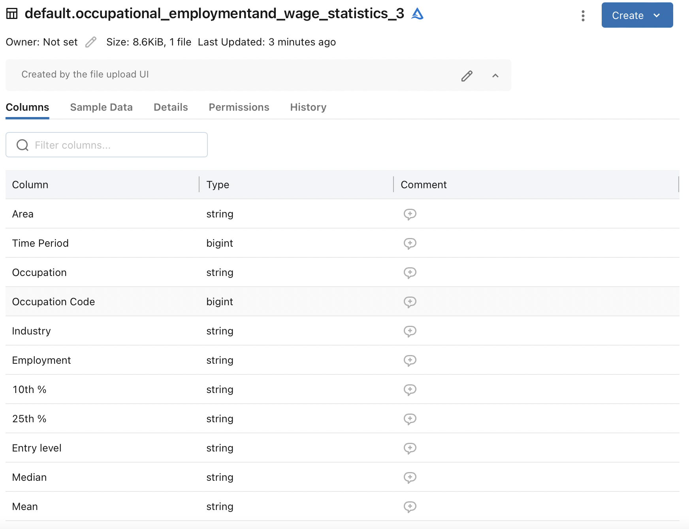
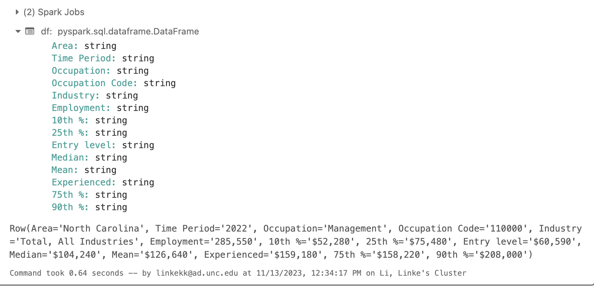
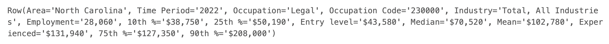

# ids706_project11_ll442

In this project, a data pipeline is created using Databricks, with one data source and data sink included. 

Specifically, first, this github repo is connected to Azure Databrick. 
Then, the data pipeline ingest, prepare and analyze are implmented in data_process.py in this repo on the platform Azure Databricks.

## Step 1: Ingest data
In this step, dataset OccupationalEmploymentandWageStatistics_final.csv uploaded to Databrick file system is ingested to the cluster of workspace with Spark.

## Step 2: Prepare data
In this step, the dataset is converted to table with df.createOrReplaceTempView("kk_table").

## Step 3: Analyze data
In this step, mean, max, min value of the dataset of each column of salary stage is found.

