# ids706_individualProject3_ll442

In this project, Databricks ETL (Extract Transform Load) Pipeline is implemented, validated and visualized.

## Databricks Notebook
The step-by-step explanation of the databricks notebook is covered in this module.

### Step1: Import the required library
`Pyspark` and `Matplotlib` are used as the fundamental dependecies for ETL pipeline and data analysis visualization. 

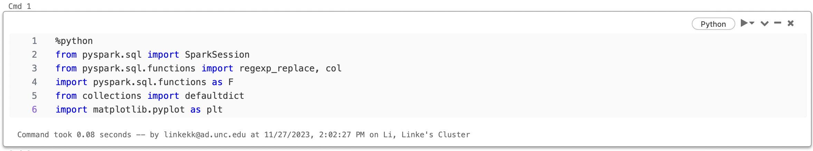

### Step 2: ETL Pipeline
1. Extract Operation

  The raw dataset used in this project is [Occupational Employment and Wage Statistics.csv](https://raw.githubusercontent.com/nogibjj/ids706_project9_ll442/4912522c139e982753fcd51a5226ad58ab5c3195/OccupationalEmploymentandWageStatistics.csv).

  After initializing a SparkSession, the raw dataset is loaded as spark dataframe and converted to the table `kk_table`.

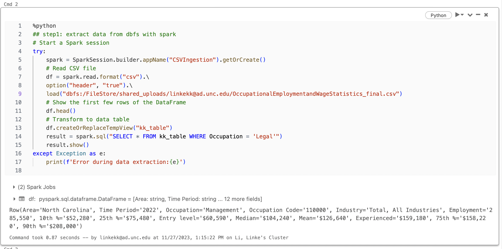

2. Transform Operation

  The dataframe of loaded `kk_table` has been transformed through **deleting illegal characters in data cells** with `regexp_replace()` and **renaming column header** with `withColumnRenamed()`.

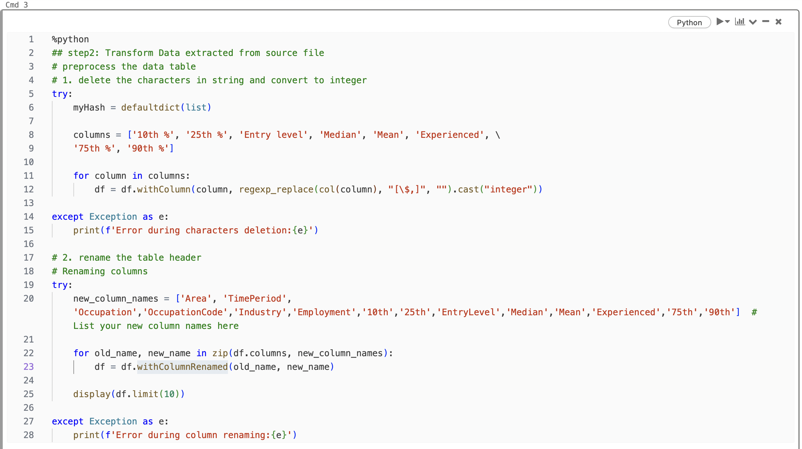
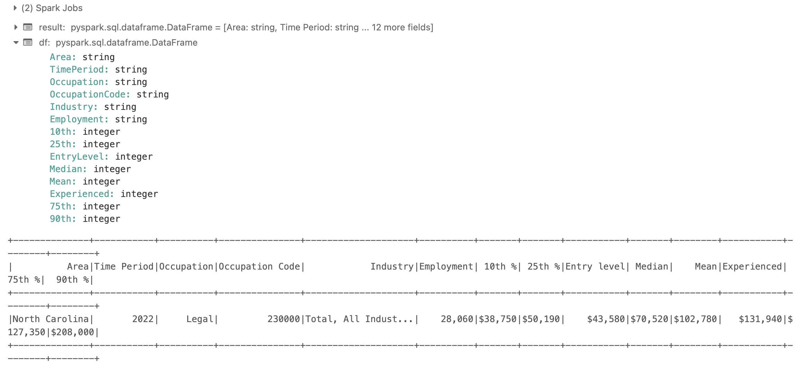
The data table transformed is shown as below:
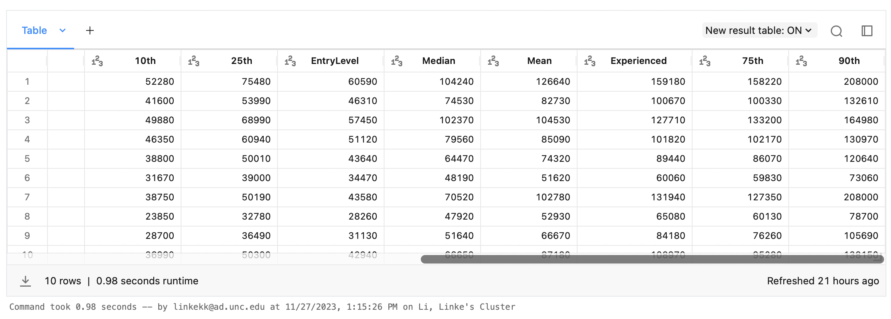

3. Load Operation

  Transformed datatable has been loaded to **Delta Lake** for further operation.

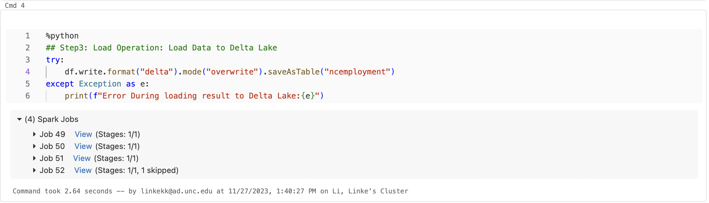
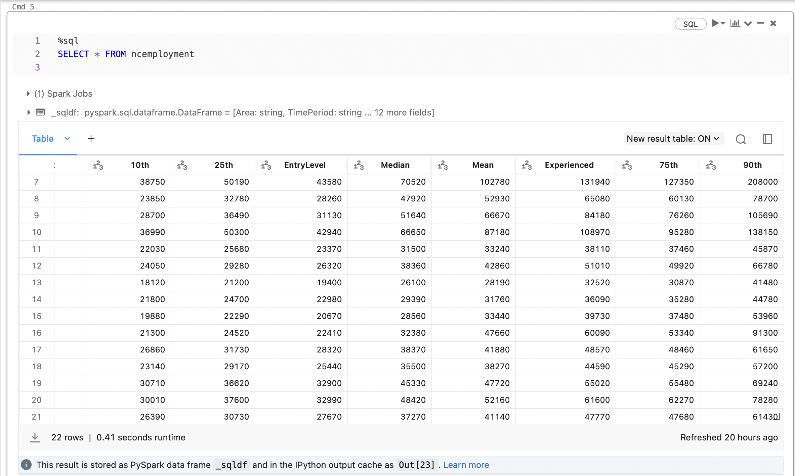

### Step3: Data Validation
The transformed table stored in Delta Lake has been loaded and its value validity has been checked.

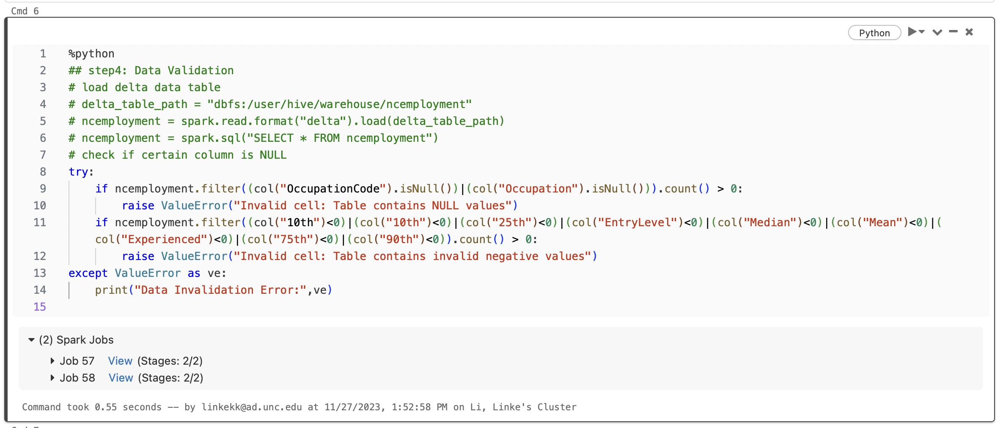

### Step4: Data Visualization and Conclusion
1. Data Visualization

  The mean, min, max value of the wages of different industries and experience level has been calculated and visualized in the graphs as shown below.

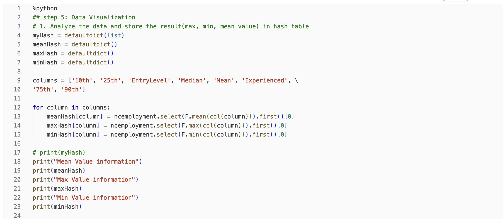
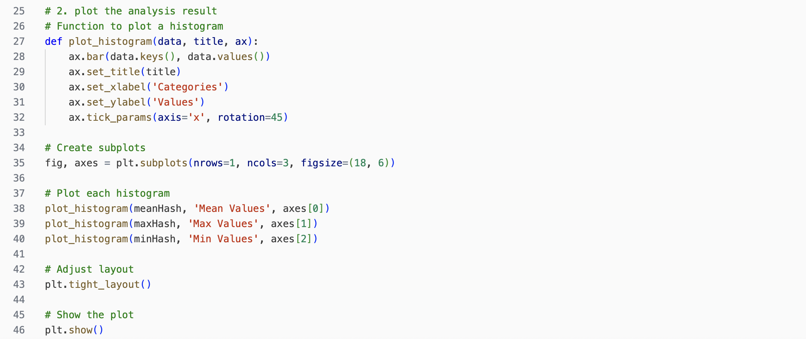
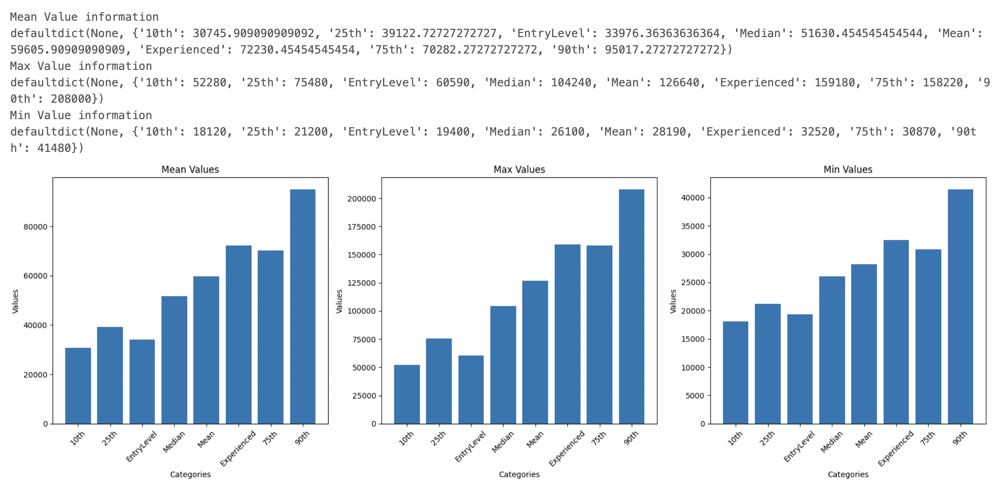
2. Reccomendation and Conclusion

  As can be seen from the visualization graph, overally, it can be concluded that **wage increases proportionally with the experience level** in North Carolina for different occupation. 

  Specifically, there is a significant salary difference between 75th and 90th, which indicates the importance of long-term experience in the majority of the fields. Additionally, for employees before median experience level, they are paid similarly because they do not have significant experience difference.

  As a result, it is recommended to **persist** to the primary career path as wage increases gradually with experience in the majority of the fields. For entry-level employee who found minimal increase in their wage, it suggested to **stick to the path for longer time** since there will be an increase in salary after early career stage.  

## Spark SQL
1. Dataset extraction

  A spark session is initialized at the start for dataset extraction and table loading.

  `spark = SparkSession.builder.appName("CSVIngestion").getOrCreate()`

  `df.createOrReplaceTempView("kk_table")`

2. SQL implementation

  Spark library can be used for convenient SQL implementation in python file.

  `result = spark.sql("SELECT * FROM kk_table WHERE Occupation = 'Legal'")`

3. Transformation

   Based on the Spark Data frame, different transformation including filtering, renaming and replacing over the original dataset can be carried out efficiently.

## Delta Lake
Dataset transformed `ncemployment` are stored in Delta Lake and can be found in hive_metastore in the cluster where the notebook runs.`dbfs:/user/hive/warehouse/ncemployment`

## Project Structure
1. `.devcontainer` includes a Dockerfile and devcontainer.json. The files in this container specify how the project can be set up and deployed to codespace.

2. `.github` includes the CI/CD settings

3. `Makefile` includes all the make settings for this project

4. All packages needed for this project are in `requirements.txt`

5. `.gitignore` includes all the files that do not want to be tracked by github

6. `image` includes all the notebook result

7. `data_process.ipynb` includes all the operations related with the dataset

8. `main.py` is the file to be tested

9. `test_main.py` is the test file for `main.py`

## Automated Trigger 
To set up automated trigger for the notebook on Azure Databricks, 

1. Create a new workflow under the workflow section of the workspace

2. Change the trigger setting to ensure automatic trigger

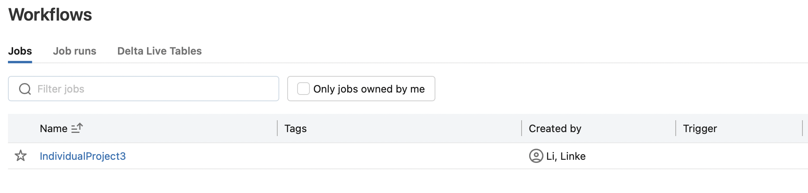

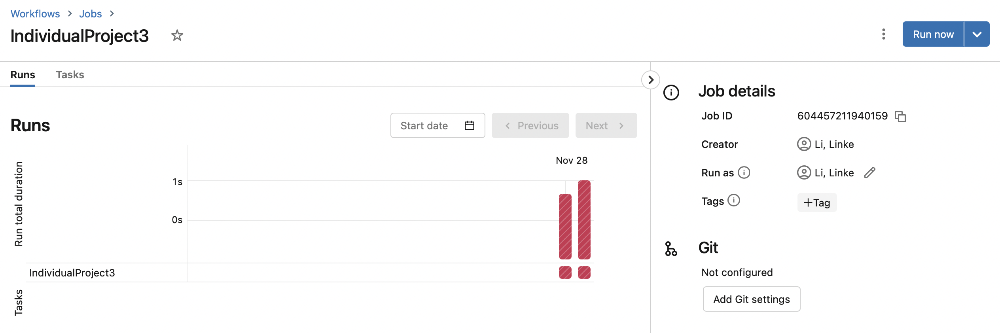

Note: However, due to the limit of the subscription resouce of my account, the automatic workflow does not run successfully!!!

Such a problem can be solved only when more resource are provided by the professor.
(Extra resource are charged...)

## Video
You can understand better about the project with this video

Hope you enjoy watching :D

